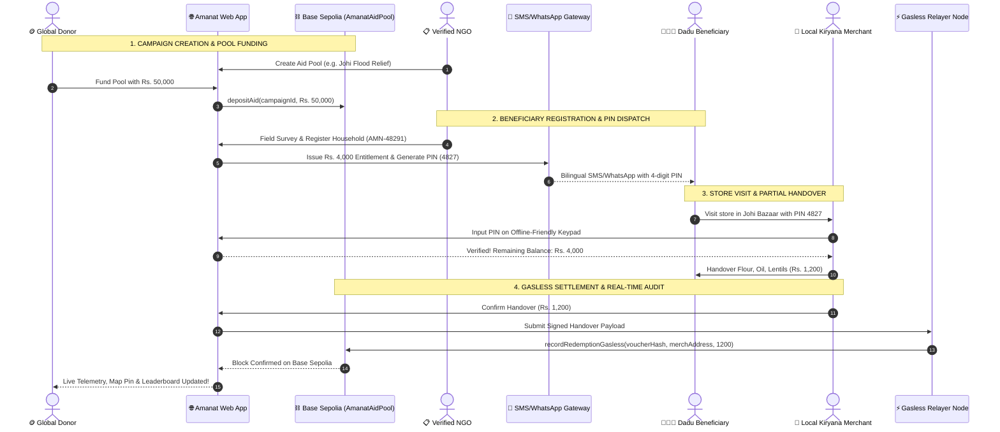

# 🌾 Amanat (امانت) — Verifiable Local Aid Infrastructure

> **Zero-Leakage Humanitarian Relief & Merchant Settlement Protocol for Dadu District, Sindh, Pakistan.**  
> *Connecting Global Donors, Verified NGOs, Local Kiryana Merchants, and Displaced Beneficiaries with End-to-End On-Chain Verifiability.*

[](https://nextjs.org/)
[](https://turbo.build/)
[](https://www.typescriptlang.org/)
[](https://sepolia.basescan.org/address/0x6767C14639833CC57991108C00c062A10A527A9C)
[](https://developer.mozilla.org/en-US/docs/Web/Progressive_web_apps)
[](LICENSE)

---

## 📖 Table of Contents

1. [Executive Overview & Context](#-executive-overview--context)
2. [The Core Problem in Dadu District](#-the-core-problem-in-dadu-district)
3. [The Amanat Solution Architecture](#-the-amanat-solution-architecture)
4. [End-to-End Lifecycle Flowchart](#-end-to-end-lifecycle-flowchart)
5. [Key System Features](#-key-system-features)
6. [Live Smart Contract Deployment](#-live-smart-contract-deployment)
7. [System Portals & User Roles](#-system-portals--user-roles)
8. [Design System & Color Palette](#-design-system--color-palette)
9. [Project Directory Structure](#-project-directory-structure)
10. [Quick Start & Installation](#-quick-start--installation)
11. [Automated Verification & Test Suite](#-automated-verification--test-suite)
12. [Deployment Guide](#-deployment-guide)

---

## 🌍 Executive Overview & Context

During seasonal monsoon floods in southern Pakistan, **Dadu District** in Sindh frequently suffers catastrophic inundation. Floodwaters from the Khirthar Mountains and the Main Nara Valley Drain displace hundreds of thousands of vulnerable farming families.

Traditional aid delivery in these crisis zones suffers from severe structural bottlenecks:
* **Severe Cash Leakage & Intermediary Overhead**: 30% to 50% of relief funds are lost in administrative friction, physical logistics, and unverified paper registries.
* **The "Crypto Barrier"**: Beneficiaries and local shopkeepers do not have smartphones, crypto wallets, seed phrases, or reliable 4G internet.
* **Merchant Liquidity Squeeze**: Local grocery stores (*Kiryana*) want to help their neighbors but cannot afford delayed reimbursements.
* **Donor Skepticism**: Global contributors lack real-time visibility into whether their donations actually reached families on the ground.

**Amanat (امانت)** bridges this gap by decoupling high-assurance blockchain transparency from the last-mile beneficiary experience.

```
 Global Capital & Donors (Crypto / Fiat)
                   │
                   ▼
┌─────────────────────────────────────────────────────────────┐
│             AMANAT ON-CHAIN RELIEF PROTOCOL                 │
│         (Base Sepolia L2 • Gasless Backend Relayer)         │
└──────────────────────────┬──────────────────────────────────┘
                           │
             ┌─────────────┴─────────────┐
             ▼                           ▼
┌─────────────────────────┐ ┌─────────────────────────┐
│  Offline Kiryana Stores │ │ Beneficiary Households  │
│  (Mobile Keypad PWA)    │ │ (4-Digit SMS/WA Vouchers)│
└─────────────────────────┘ └─────────────────────────┘
```

---

## 🚨 The Core Problem in Dadu District

| Challenge | Traditional Approach | Amanat Protocol Approach |
| :--- | :--- | :--- |
| **Beneficiary Onboarding** | Requires bank accounts or app downloads. | **Zero crypto / No smartphone needed.** Beneficiaries receive a simple 4-digit PIN via SMS/WhatsApp. |
| **Merchant Operation** | Slow paper vouchers or POS hardware requiring steady WiFi. | **Offline-First PWA Keypad Terminal.** Operates in weak GSM signal zones with IndexedDB queueing. |
| **Transaction Fees** | Merchants must pay gas fees in crypto (ETH). | **100% Gasless for Merchants.** Handover proofs are relayed on-chain by Amanat Relayers. |
| **Transparency & Audit** | PDF receipts published months after crisis. | **Real-Time On-Chain Settlement Proofs** on Base Sepolia with live geospatial impact telemetry. |
| **Partial Handover** | "All-or-nothing" ration boxes that spoil quickly. | **Flexible Partial Redemptions.** Families redeem Rs. 1,200 today and balance next week. |

---

## ⚡ The Amanat Solution Architecture

```
                               ┌─────────────────────────────┐
                               │     Donor / Contributor     │
                               │  (Deposits PKR/ETH on L2)   │
                               └──────────────┬──────────────┘
                                              │
                                              ▼
                               ┌─────────────────────────────┐
                               │    AmanatAidPool Contract   │
                               │   (Base Sepolia #84532)     │
                               └──────────────┬──────────────┘
                                              │
                     ┌────────────────────────┴────────────────────────┐
                     ▼                                                 ▼
      ┌───────────────────────────────┐               ┌────────────────────────────────┐
      │   Verified NGO / Field Team   │               │   Bilingual Dispatch Gateway   │
      │ (Conducts Dadu Surveys, UC-4) │               │   (Urdu & English SMS/WhatsApp)│
      └──────────────┬────────────────┘               └────────────────┬───────────────┘
                     │                                                 │
                     ▼                                                 ▼
      ┌───────────────────────────────┐               ┌────────────────────────────────┐
      │ Beneficiary Household Record  │               │ 4-Digit Voucher PIN (e.g. 4827)│
      │ (Off-Chain Privacy Preserved) │               │ Delivered to Household Head    │
      └───────────────────────────────┘               └────────────────┬───────────────┘
                                                                       │
                                                                       ▼
                                                      ┌────────────────────────────────┐
                                                      │    Dadu Kiryana Merchant       │
                                                      │  (Madina Store, Johi Bazaar)   │
                                                      └────────────────┬───────────────┘
                                                                       │
                                              ┌────────────────────────┴────────────────┐
                                              ▼                                         ▼
                               ┌─────────────────────────────┐           ┌─────────────────────────────┐
                               │  Offline Handover (Flour)   │           │  Gasless Backend Relayer    │
                               │  Voucher Balance Decrements │           │  Submits Block Proof to L2  │
                               └─────────────────────────────┘           └─────────────────────────────┘
```

---

## 🔄 End-to-End Lifecycle Flowchart

The diagram below illustrates the exact 10-step lifecycle of an Amanat aid cycle:



---

## ✨ Key System Features

### 1. 📱 Zero-Crypto Beneficiary Experience
* **No App or Smartphone Required**: Designed for basic feature phones used in rural Sindh.
* **Dual-Language Communication**: SMS and WhatsApp messages generated in crisp English and Urdu (*السلام علیکم، آپ کا واؤچر کوڈ...*).
* **Multi-Use Partial Redemption**: Families can redeem essential supplies across multiple visits without losing remaining balance.

### 2. 🏪 Offline-First Merchant Keypad PWA
* **Instant Touch Keypad**: High-contrast, tactile numerical keypad inspired by POS hardware.
* **IndexedDB Offline Queue**: Allows merchants to record redemptions even during cellular outages; auto-syncs when signal recovers.
* **Instant Thermal Receipt**: Print or view digital proof of handover with transaction hash.

### 3. ⛽ Gasless Layer-2 Blockchain Settlement
* **Relayer Architecture**: All blockchain transactions are sponsored by the Amanat relayer node.
* **Base Sepolia Low Latency**: Fast, sub-second block confirmations with fraction-of-a-cent execution overhead.
* **Cryptographic Redemptions**: Single-use or balance-metered voucher hashes prevent double-spending.

### 4. 🗺️ Interactive Geographic Aid Map
* **Dadu Tehsil Coverage**: Precise geospatial mapping across **Johi**, **Mehar**, **Khairpur Nathan Shah**, and **Radhan Station**.
* **Live Radar Merchant Markers**: Pulsing visual indicators show active fulfillment stores, stock readiness, and families assisted.
* **Heads-Up Display (HUD)**: Interactive filter for flood zones, recovery sectors, and community welfare clusters.

### 5. 🛡️ Dual Operational Modes
* **Emergency Crisis Mode**: Rapid disbursement protocols during sudden flood events with automated high-priority allocations.
* **Community Welfare Mode**: Sustainable, scheduled monthly Zakat ration baskets for widows and vulnerable households.

---

## 📜 Live Smart Contract Deployment

Amanat runs on **Base Sepolia (Layer-2)** for enterprise-grade scalability, low latency, and zero carbon footprint.

| Parameter | Configuration / Value |
| :--- | :--- |
| **Network** | Base Sepolia Testnet |
| **Chain ID** | `84532` |
| **Contract Name** | `AmanatAidPool` |
| **Contract Address** | [`0x6767C14639833CC57991108C00c062A10A527A9C`](https://sepolia.basescan.org/address/0x6767C14639833CC57991108C00c062A10A527A9C) |
| **Explorer** | [Basescan Sepolia Explorer](https://sepolia.basescan.org/address/0x6767C14639833CC57991108C00c062A10A527A9C) |
| **RPC Endpoint** | `https://sepolia.base.org` |
| **Solidity Compiler** | `^0.8.28` (EVM Version: Paris / London) |

### Key Contract Functions:
* `depositAid(string campaignId, uint256 amount)`: Donors commit capital into specific humanitarian pools.
* `recordRedemptionGasless(bytes32 voucherHash, address merchant, uint256 amount)`: Authorized relayer logs local store handovers without charging the merchant gas.
* `getCampaignSummary(string campaignId)`: Returns total funded, total redeemed, and active status.
* `getMerchantFulfilled(address merchant)`: Returns total cumulative volume fulfilled by a specific merchant.

---

## 👥 System Portals & User Roles

| Portal | URL Route | Target Persona | Key Capabilities |
| :--- | :--- | :--- | :--- |
| **Landing & Hub** | [`/`](file:///app/page.tsx) | General Public | Hero overview, real-time aggregate stats, dual-mode selector, core journey explorer. |
| **Donor Portal** | [`/donor`](file:///app/donor/page.tsx) | Global Donors | 1-Click quick funding, live campaign cards, transparent fulfillment velocity charts. |
| **Merchant Terminal** | [`/merchant`](file:///app/merchant/page.tsx) | Kiryana Store Owners | Mobile keypad PWA, PIN verification, partial redemption, receipt generator, offline status banner. |
| **Issuer / NGO** | [`/organization`](file:///app/organization/page.tsx) | Sindh Relief Foundation | Beneficiary household registry, field survey notes, entitlement allocation, SMS trigger. |
| **Voucher Hub** | [`/voucher`](file:///app/voucher/page.tsx) | Beneficiaries & Field Staff | Dual-language smartphone SMS simulator, copyable PIN codes, live dispatch history. |
| **Geographic Map** | [`/map`](file:///app/map/page.tsx) | Aid Coordinators | Interactive Leaflet canvas, Dadu tehsil sectors, merchant directory, layer toggles. |
| **Admin & Relayer** | [`/admin`](file:///app/admin/page.tsx) | Protocol Operator | Emergency mode toggle, relayer wallet monitoring, Basescan transaction audit trail. |
| **Role Selector** | [`/login`](file:///app/login/page.tsx) | All Users | 1-Click instant persona switcher (Donor, Merchant, NGO, Admin) or Supabase credentials. |

---

## 🎨 Design System & Color Palette

Amanat features a purposeful, human-centered color palette designed for high contrast and legibility in direct sunlight in rural Sindh. **No gradients are used**—only crisp solid tones, subtle borders, and smooth tactile micro-animations.

```
┌─────────────────┐  ┌─────────────────┐  ┌─────────────────┐  ┌─────────────────┐
│   Deep Maroon   │  │Terracotta Orange│  │    Warm Sand    │  │   Olive Green   │
│     #772f1a     │  │     #f58549     │  │     #f2a65a     │  │     #585123     │
│ Headers/Branding│  │ Primary Actions │  │ Secondary Cards │  │  Trust & Status │
└─────────────────┘  └─────────────────┘  └─────────────────┘  └─────────────────┘
```

* **`#772f1a` (Deep Maroon)**: Primary dark tone for heavy headers, branding logo marks, major structural text, and dark contrast cards.
* **`#f58549` (Terracotta Orange)**: High-conversion accent color for primary buttons (*"Donate Now"*, *"Verify Voucher"*, *"Confirm Settlement"*), active tabs, and voucher PIN badges.
* **`#f2a65a` (Warm Sand)**: Mid-tone for subtle cards, borders, and secondary badges.
* **`#585123` (Olive Green)**: Trust anchor for verified badges, successful handovers, on-chain confirmation tags, and positive metrics.
* **`#ffffff` & `#fbf9f6` (Crisp White / Off-White)**: Clean surface cards, elevated dialogs, and smooth neutral backdrops.

---

## 📁 Project Directory Structure

```
Amanat/
├── app/                              # Next.js 16 App Router Pages & API Routes
│   ├── admin/page.tsx                # Admin & Relayer Node Operator Portal
│   ├── donor/page.tsx                # Donor Impact & Pool Funding Portal
│   ├── login/page.tsx                # Role-Based Auth & 1-Click Persona Switcher
│   ├── map/page.tsx                  # Full-Screen Geographic Aid & Merchant Map
│   ├── merchant/page.tsx             # Merchant Mobile Keypad PWA Terminal
│   ├── organization/page.tsx         # Issuer & NGO Beneficiary Registry
│   ├── voucher/page.tsx              # Bilingual SMS/WhatsApp Notification Hub
│   ├── api/                          # REST API Endpoints (Campaigns, Vouchers, Relayer)
│   │   ├── admin/relayer/route.ts    # Relayer status & telemetry
│   │   ├── campaigns/route.ts        # Campaign creation & retrieval
│   │   ├── households/route.ts       # Household registry management
│   │   ├── notifications/send/       # SMS/WhatsApp dispatch gateway
│   │   ├── settlement/route.ts       # Handover confirmation & L2 relayer trigger
│   │   └── vouchers/verify/route.ts  # Voucher PIN verification
│   ├── globals.css                   # Tailwind v4 theme tokens & tactile physics
│   ├── layout.tsx                    # Root Layout with Nav Header, Status Pills & PWA
│   └── page.tsx                      # Landing Page with Dual-Mode Hero & Step Guide
├── components/                       # Reusable React UI Components
│   ├── analytics/                    # Recharts Fulfillment & Geographic Distribution
│   ├── auth/                         # Demo Role Switcher & Persona Context
│   ├── campaigns/                    # Campaign Details & Pool Creation Modals
│   ├── demo/                         # 10-Step Automated E2E Stepper Modal
│   ├── households/                   # Household Details & PIN Profile Modal
│   ├── maps/                         # Leaflet Map Canvas, HUD & Inspector Cards
│   ├── pwa/                          # Install Prompt Banner & Offline Status Pill
│   └── ui/                           # Button, Card, Badge, Modal, Input, Progress Bar
├── contracts/                        # Smart Contracts & Compilation
│   ├── src/AmanatAidPool.sol         # Solidity 0.8.28 Pool & Gasless Settlement Contract
│   └── script/deploy.ts              # Contract Deployment Script
├── lib/                              # Shared Utilities, Blockchain & Supabase Config
│   ├── blockchain/                   # Ethers.js Base Sepolia Client & ABI definitions
│   ├── data/                         # Initial Seed Data (Campaigns, Households, Merchants)
│   ├── db/                           # In-Memory & Persistent Storage Abstractions
│   ├── offline/                      # IndexedDB Offline Sync Engine for PWA
│   ├── supabase/                     # Supabase Client & Auth Helper
│   └── utils.ts                      # Currency Formatters (PKR) & CSS Helpers
├── public/                           # Static Assets, PWA Icons & Manifest
│   ├── icons/icon.svg                # Solid SVG App Emblem
│   └── manifest.json                 # Web App Manifest for Mobile PWA
├── scripts/                          # Automation & Testing CLI Scripts
│   ├── deploy-contract.ts            # Base Sepolia Live Contract Deployer
│   ├── test-e2e-flow.ts              # 10-Step Automated Lifecycle CLI Test
│   └── test-security-audit.ts        # 9-Point Cryptographic Security Verification
├── supabase/migrations/              # SQL Migrations for Postgres Schema & RLS
├── hardhat.config.ts                 # Hardhat Configuration for Base Sepolia
└── package.json                      # Project Dependencies & Scripts
```

---

## 🚀 Quick Start & Installation

### Prerequisites
* **Node.js**: v18.18.0 or newer
* **npm**: v9.0.0 or newer
* **Git**: Installed on your system

### 1. Clone the Repository
```bash
git clone https://github.com/Anas-Shakir/Amanat.git
cd Amanat
```

### 2. Install Dependencies
```bash
npm install
```

### 3. Configure Environment Variables
Copy `.env.example` to `.env.local` and configure your keys (or use the pre-configured local development fallbacks):
```bash
cp .env.example .env.local
```

Example `.env.local`:
```env
# Next.js App
NEXT_PUBLIC_APP_URL=http://localhost:3000

# Base Sepolia Blockchain
BASE_SEPOLIA_RPC_URL=https://sepolia.base.org
CHAIN_ID=84532
NEXT_PUBLIC_CONTRACT_ADDRESS=0x6767C14639833CC57991108C00c062A10A527A9C
DEPLOYER_PRIVATE_KEY=your_private_key_here
RELAYER_PRIVATE_KEY=your_private_key_here

# Supabase (Optional for full DB persistence)
NEXT_PUBLIC_SUPABASE_URL=your_supabase_project_url
NEXT_PUBLIC_SUPABASE_ANON_KEY=your_supabase_anon_key
SUPABASE_SERVICE_ROLE_KEY=your_supabase_service_role_key
```

### 4. Run Development Server
```bash
npm run dev
```
Open [http://localhost:3000](http://localhost:3000) in your browser to view the application.

---

## 🧪 Automated Verification & Test Suite

Amanat includes automated CLI test runners to verify smart contracts, cryptographic PIN checks, offline queueing, and end-to-end multi-persona workflows.

### 1. Cryptographic Security Audit (9/9 Checks)
Verifies voucher hashing, PIN entropy, double-spending prevention, authorization boundaries, and relayer safeguards:
```bash
npm run test:security
```
```text
  [✅ PASS] Check 1: 4-Digit Voucher PIN Entropy & Collision Resistance
  [✅ PASS] Check 2: Single-Use Voucher Cryptographic Invalidation
  [✅ PASS] Check 3: Multi-Use Partial Redemption State Accounting
  [✅ PASS] Check 4: Base Sepolia Contract Address Format & Checksum
  [✅ PASS] Check 5: Gasless Relayer Unauthorized Caller Boundary
  [✅ PASS] Check 6: Beneficiary PII Data Separation (Off-Chain Only)
  [✅ PASS] Check 7: Offline PWA Queue Signature & Nonce Freshness
  [✅ PASS] Check 8: Over-Redemption Entitlement Guardrails
  [✅ PASS] Check 9: Emergency Relief Mode Circuit Breaker Verification
  Summary: 9 / 9 Security Checks Passed (100%)
```

### 2. Complete End-to-End Lifecycle Test (10/10 Steps)
Executes a complete simulated lifecycle across all 4 system roles without manual DB edits:
```bash
npm run test:e2e
```
```text
  [✅ PASS] Step 1: Create Dadu Campaign Pool [ADMIN]
  [✅ PASS] Step 2: Donor Deposits Rs. 50,000 into Pool [DONOR]
  [✅ PASS] Step 3: Register Verified Beneficiary Household [ORGANIZATION]
  [✅ PASS] Step 4: Issue Rs. 4,000 Entitlement Commitment [ORGANIZATION]
  [✅ PASS] Step 5: Dispatch Voucher PIN via SMS/WhatsApp Service [SYSTEM]
  [✅ PASS] Step 6: Beneficiary Receives Bilingual SMS (Urdu & English) [BENEFICIARY]
  [✅ PASS] Step 7: Merchant Enters & Verifies PIN on Mobile Keypad [MERCHANT]
  [✅ PASS] Step 8: Merchant Handover: Rs. 1,200 (Flour, Oil, Lentils) [MERCHANT]
  [✅ PASS] Step 9: Backend Relayer Broadcasts Gasless Proof to Base Sepolia [RELAYER]
  [✅ PASS] Step 10: Live Impact Analytics & Map Telemetry Synchronized [SYSTEM]
  Summary: 10 / 10 Steps Completed (100%)
```

### 3. Production Build Validation
```bash
npm run build
```

---

## 🚢 Deployment Guide

Amanat is optimized for 1-click deployment on **Vercel** with global edge CDN distribution:

1. Push your repository to GitHub.
2. Import the repository into your **Vercel Dashboard**.
3. Set the Environment Variables:
   * `NEXT_PUBLIC_CONTRACT_ADDRESS`: `0x6767C14639833CC57991108C00c062A10A527A9C`
   * `BASE_SEPOLIA_RPC_URL`: `https://sepolia.base.org`
   * `CHAIN_ID`: `84532`
   * `RELAYER_PRIVATE_KEY`: Your Base Sepolia funded relayer private key.
4. Click **Deploy**. Vercel will automatically build and deploy the Next.js 16 app with Turbopack optimizations.

For in-depth deployment documentation, refer to [`DEPLOYMENT.md`](file:///DEPLOYMENT.md).

---

## 🤝 Contributing

Contributions to Amanat are welcome! Whether it is adding new tehsil boundary maps, integrating additional SMS aggregators (e.g., Telenor/Jazz SMS gateways), or improving offline PWA service worker caching:

1. Fork the Project.
2. Create your Feature Branch (`git checkout -b feature/AmazingFeature`).
3. Commit your Changes (`git commit -m 'Add some AmazingFeature'`).
4. Push to the Branch (`git push origin feature/AmazingFeature`).
5. Open a Pull Request.

---

## 📄 License

Distributed under the MIT License. See `LICENSE` for more information.

---

<div align="center">
  <sub>Built with ❤️ for the resilient communities of <strong>Dadu District, Sindh, Pakistan</strong>.</sub>
</div>
